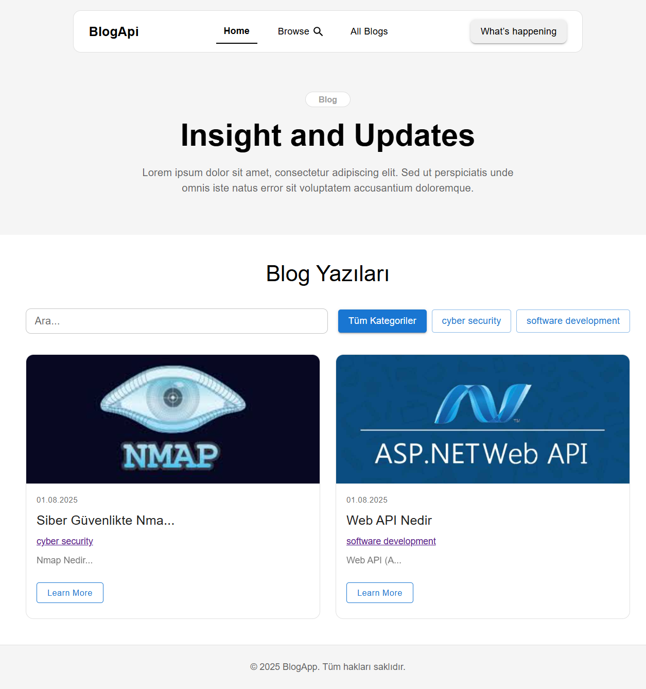

# Blog Yazı Platformu

Kullanıcıların blog yazılarını görüntüleyebildiği, kategori ve arama filtreleri ile kolayca içerik bulabildiği modern React uygulaması.
Frontend için React + MUI, backend için REST API ( Net Core webapi ) kullanılmıştır. Geliştiriciler ve içerik okuyucular için tasarlanmıştır.


## Ekran Görüntüleri



  
## Bilgisayarınızda Çalıştırın

Projeyi klonlayın

```bash
  git clone https://github.com/muhammetemiraslan/blog-api.git
```

Proje dizinine gidin

```bash
  cd client
```

Gerekli paketleri yükleyin

```bash
  npm i
```

Sunucuyu çalıştırın

```bash
  npm run dev
```


Proje dizinine gidin

```bash
  cd api
```

Gerekli paketleri yükleyin

```bash
  dotnet add package Microsoft.EntityFrameworkCore.Sqlite
  dotnet add package Microsoft.EntityFrameworkCore.Tools
```

Sunucuyu çalıştırın

```bash
  dotnet watch
```

  
